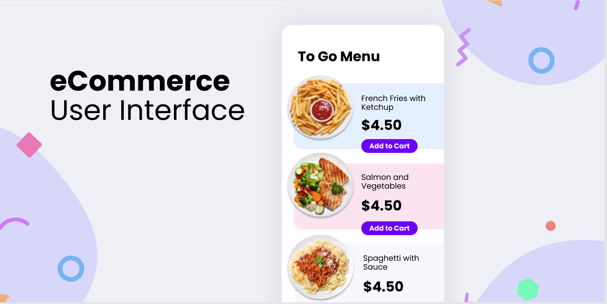

# Make It Real - eCommerce component.

## Reto

Su desafío es construir este componente de comercio electrónico y lograr que se parezca lo más posible al diseño.

Puedes usar cualquier herramienta que te guste para ayudarte a completar el desafío. Entonces, si tienes algo que te gustaría practicar, no dudes en intentarlo.

Los usuarios deben ser capaces de:

- Vea los platos en el lado izquierdo de la pantalla y agréguelos a su carrito en el lado derecho.
- Cuando no haya platos en su carrito, debería ver un mensaje que dice: "Su carrito está vacío".
- Cuando se agrega un plato a su carrito, el subtotal y los totales se actualizarán automáticamente.
- Cuando los productos están en su carrito, debería poder aumentar y disminuir la cantidad.
  - Un usuario no debería poder marcar la cantidad como un número negativo.
  - Si la cantidad baja a 0, el usuario tendrá la opción de eliminar o eliminar el producto de su carrito por completo.
- El impuesto se basa en el impuesto sobre las ventas del estado de Tennessee: 0,0975

## Diseño

Los diseños están en formato JPG estático. El uso de archivos PNG significará que deberá usar su mejor criterio para estilos como "tamaño de fuente", "padding" y "margen".

### Style Guide

Los diseños se crearon con los siguientes anchos:

- Mobile: 375px
- Desktop: 1440px

## Colores

### Primary

- background color: #EFF0F6
- border color: #d7d6fc
- primary purple: #6B00F5
- Pattens Blue: #e1f0fe
- Ghost White: #f7f7ff
- White Ice: #defef0

## Tipografía

### Body Copy

- Font size: 16px

### Font

- Family: [Poppins](https://fonts.google.com/specimen/Poppins)
- Weights: 400, 700

## Construyendo tu proyecto

Siéntase libre de usar cualquier flujo de trabajo con el que se sienta cómodo. A continuación se sugiere un proceso, pero no sienta que necesita seguir estos pasos:

1. Inicializa tu proyecto como repositorio público en [GitHub](https://github.com/). La creación de un repositorio hará que sea más fácil compartir su código con la comunidad si necesita ayuda. Si no está seguro de cómo hacer esto, [lea este recurso](https://guias.makeitreal.camp/git) .
2. Mire los diseños para comenzar a planificar cómo abordará el proyecto. Este paso es crucial para ayudarlo a pensar con anticipación en las clases de CSS para crear estilos reutilizables.
3. Antes de agregar estilos, estructura tu contenido con HTML. Escribir tu HTML primero puede ayudar a centrar tu atención en crear contenido bien estructurado.
4. Escriba los estilos base para su proyecto, incluidos los estilos de contenido general, como `font-family` y `font-size`.
5. Comience a agregar estilos en la parte superior de la página y siga hacia abajo. Pase a la siguiente sección solo cuando esté satisfecho de haber completado el área en la que está trabajando.

## Crea un `README.md` personalizado

Recomendamos encarecidamente sobrescribir este `README.md` con uno personalizado. Proporcionamos una plantilla dentro del archivo [`README-template.md`](./README-template.md) en este código de inicio.

La plantilla proporciona una guía sobre qué agregar. Un `README` personalizado lo ayudará a explicar su proyecto y reflexionar sobre sus aprendizajes. Por favor, siéntete libre de editar nuestra plantilla tanto como quieras.

**¡Diviértete construyendo!** 🚀
