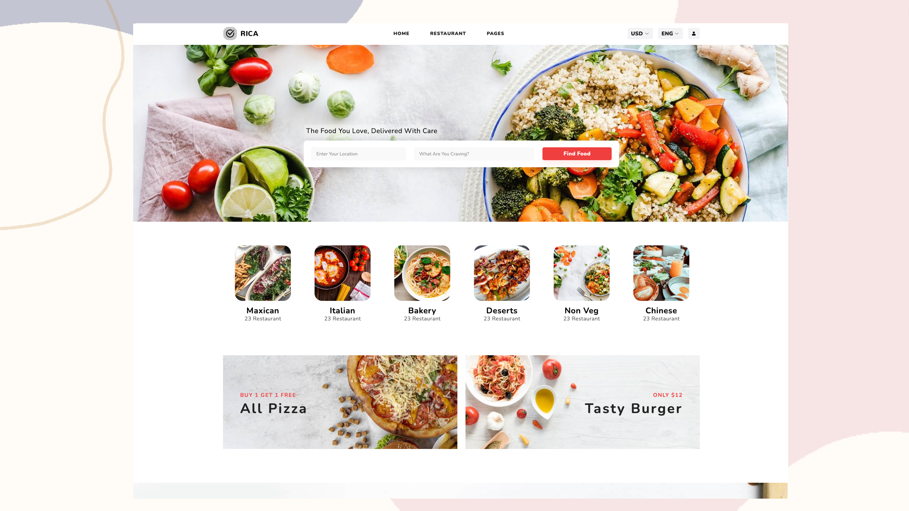

# Make It Real - Restaurants

## Descripción

La aplicación le permite a los usuarios buscar comida que ofrece los restaurantes para pedir por domicilio, de igual forma podran reservar una mesa en ese restaurante. El sistema tendra 3 roles principales (usuarios, admin, restaurantes). Los usuarios pueden buscar lo que necesitan por ciudad o alimento. Los administradores pueden ver todos los restaurantes existentes asi como la opcion de ocultar o mostar alguno especifico, los resutarantes podran ver las reservas que se han hecho y los pedidos realizados por los usuarios para ser entregados.

Puedes usar cualquier herramienta que te guste para ayudarte a completar el proyecto.

**Tus usuarios deberían poder:**

- Registrarse.
- Ingresar / Salir.
- Cambiar contraseña.
- Recuperar contraseña.
- Buscar restaurante o comida.
- Ver los detalles de un restaurante.
- Reservar restaurante en un rango de fechas y hacer el pago.
- Recibir al correo electronico la informacion de su reserva.
- Ver las reservas que ha hecho.
- Ver el diseño óptimo para el componente según el tamaño de pantalla de su dispositivo.

**Los administradores del sistema deberían poder:**

- Ingresar / Salir.
- Administrar los restaurantes (Listar, ocultar/mosrtar).
- Agregar mas administradores.

**Los restaurante del sistema deberían poder:**

- Ingresar / Salir.
- Administrar sus productos y reservas (listar, agregar, eliminar).

**Un restaurante tiene al menos:**

- Un título.
- Un acerca de.
- Una ubicación (ciudad, lat-lng, direccion).
- Unas imágenes.
- Lista de facilities.
- Lista de Reviews.
- Puede reservar una mesa para tener una cena/almuerzo.
- Productos para pedir por domicilio.

**Tecnologias:**

- React
- Redux
- React Router
- React Hooks
- Node.js
- Express
- MongoDB
- Mongoose
- JWT
- Bcrypt
- Cloudinary

#### El Proyecto Grupal debe tener:

- Desarrollar y lograr que se parezca lo más posible al diseño.
- Deben tener minimamente 2 roles de usuario (admin y usuario).
- Debe ser responsive (mobile first).
- Registro y autenticación de usuarios.
- Almacenar información en una base de datos (MongoDB).
- El backend debe estar implementado en Node.js (Express) y el frontend en React.
- Debe incluir carga de imágenes y envío de correos.
- Debe tener al menos una de las siguientes funcionalidades:
    - Pagos
    - Tiempo Real (Web Sockets).
- Debe estar desplegada en Internet (Netllify, Heroku, Vercel)
- Debe al menos tener pruebas end-to-end con Cypress.

## Diseño

Los diseños están en formato PNG estático. El uso de archivos PNG significará que deberá usar su mejor criterio para estilos como "tamaño de fuente", "padding" y "margen".

### Style Guide

Los diseños se crearon con los siguientes anchos:

- Mobile: 375px
- Desktop: 1440px

## Colores

### Primary

- Amarantha (accent): #F13F4B
- Alabaster (main background): #F9F9F9

### Neutral

- White (main cards): #FFFFFF
- Cod Gray : #1B1B1B
- Silver Chalice (text): #A1A1A1
- Black (text): #000000

## Tipografía

### Body Copy

- Font size: 15px

### Font

- Family: [Nunito](https://fonts.google.com/specimen/Nunito)
- Weights: 800, 700

**¡Diviértete construyendo!** 🚀
