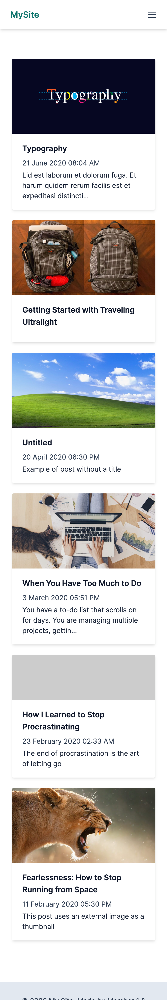
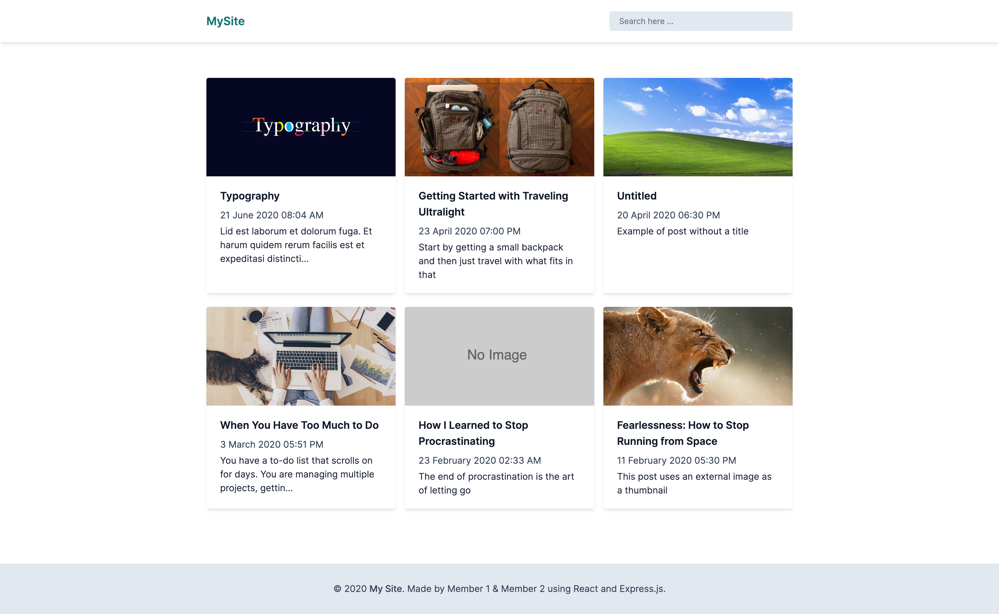
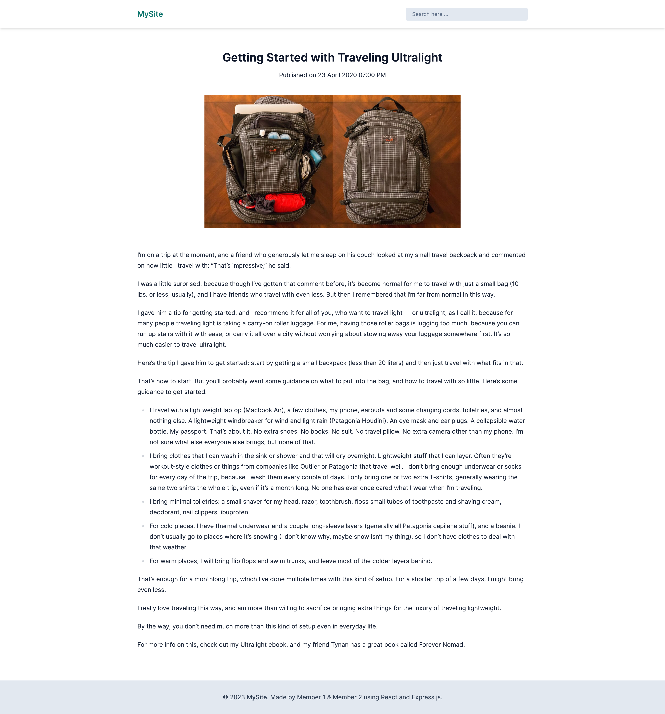

# Proyecto: Aplicación web CRUD con React y Express

## Descripción:

En este proyecto en parejas para el bootcamp Fullstack Top de [Make It Real](https://makeitreal.camp/), se desarrollará una aplicación web que permita realizar las operaciones básicas del CRUD (Crear, Leer, Actualizar y Eliminar) usando React y Express. La aplicación almacenará los datos en memoria en el lado del backend y tendrá una API REST para las operaciones CRUD.

La aplicación tendrá una interfaz de usuario sencilla e intuitiva que permita a los usuarios interactuar con la aplicación y realizar las operaciones CRUD sin dificultad. Además, se implementarán validaciones para asegurarse de que los datos ingresados sean correctos y se mostrarán mensajes de error claros en caso de que se produzcan errores.

Se utilizará React para construir la interfaz de usuario y Express para crear la API REST en el backend. Los datos se almacenarán en memoria en el lado del backend y se utilizarán las operaciones CRUD para interactuar con ellos.

El proyecto se dividirá en varias etapas, comenzando por la planificación y diseño de la aplicación, seguido de la implementación de la interfaz de usuario y la API REST, y finalmente la implementación de las operaciones CRUD y el despliegue en producción.

## Objetivos:

- Desarrollar una aplicación web que permita realizar las operaciones CRUD usando React y Express.
- Almacenar los datos en memoria en el lado del backend y crear una API REST para las operaciones CRUD.
- Implementar una interfaz de usuario sencilla e intuitiva que permita a los usuarios interactuar con la aplicación.
- Implementar validaciones para asegurarse de que los datos ingresados sean correctos y mostrar mensajes de error claros en caso de que se produzcan errores.
- Dividir el proyecto en etapas.
- Desplegar la aplicación de React y Express por separado en plataformas como Vercel y Railway.

## Tecnologías utilizadas:

- React
- Express
- Git

## Entregables:

- Código fuente del proyecto en un repositorio de Git
- Link a la aplicación desplegada en producción
- Documentación del proyecto (descripción, objetivos, tecnologías utilizadas, instrucciones de uso, etc.)

## Imagenes de referencia

### Vista principal Mobile

### Vista principal Desktop

### Vista de detalle

### Vista de Creacion
Pueden realizarla a su gusto.

### Vista de Edicion
Pueden realizarla a su gusto.

### Vista de Eliminacion
Pueden realizarla a su gusto.

¡Espero que esta descripción te sea útil para llevar a cabo tu proyecto con éxito! Si necesitas más ayuda, no dudes en preguntar.
